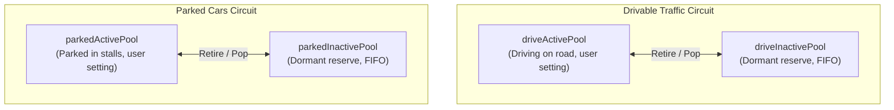

# RLS Career: Vehicle Rotation Pool

## TL;DR — What It Does

- **High-Variety Fleet Rotation**: Eliminates the repetitive loop of seeing the exact same few cars driving around you or empty, static parking lots across the county.
- **Hardware-Adaptive Fleet Reserve**: Automatically scales reserve depth based on detected RAM and VRAM (up to 20 reserve cars per circuit on 24GB+ systems, scaling down gracefully on lower hardware).
- **Zero-Hitch Dormant Swapping**: Inactive cars have physics frozen and meshes hidden, swapping instantly without disk hitches.
- **Persistent Police Pursuits**: Chasing police never despawn mid-pursuit, even when crashed or falling behind, while uninvolved cruisers cycle normally.
- **Event & Mission Auto-Suppression**: Clears traffic during races, time trials, and demolition derbies to restore maximum FPS, while seamlessly preserving ambient traffic during missions that require it.

---

## 1. Motivation

In base BeamNG and RLS Career traffic:
- **Repetitive Fleet**: Spawns only the exact number of active cars configured in settings (e.g. 5–6), leading to constant loops of identical vehicles.
- **Barren Parking**: Parked cars spawn once at map launch and stay frozen in distant neighborhoods, leaving lots ahead completely empty.
- **Broken Police Chases**: Police cars in pursuit frequently despawn when falling slightly behind, crashed into obstacles, or abruptly teleport right in front of you.

The **Vehicle Rotation Pool** keeps a deep reserve of vehicles behind the scenes, rotates fresh models into view, protects active police pursuits, and clears the streets during competitive events.

---

## 2. Dual-Circuit Architecture

Traffic and parked vehicles operate in two strictly isolated circuits to avoid powertrain/AI glitches caused by converting parked cars into driving traffic:

- **Traffic Circuit**: Spawns with running engines and active traffic AI. When dormant, physics is suspended; when unfrozen, vehicles drive off instantly.
- **Parked Circuit**: Spawns in stalls with engines off and handbrakes set. Only rotates between parking spots.

---

## 3. Hardware-Aware Fleet Sizing

To ensure zero risk of out-of-memory crashes on diverse player hardware, the pool dynamically detects available free system RAM (`Engine.Platform.getMemoryInfo()`) and free GPU VRAM (`Engine.Render.getMemoryInfo()`) at runtime to establish the reserve fleet floor:

$$\text{total\_drive\_fleet} = \max(\text{fleet\_floor}, \text{user\_settings.drivable})$$
$$\text{total\_parked\_fleet} = \max(\text{fleet\_floor}, \text{user\_settings.parked})$$

*(If parked cars are disabled via settings or `noParkedMode`, the parked fleet is 0).*

#### Hardware Tiering Table (Available Free Memory):
| Hardware Tier | Free System RAM | Free GPU VRAM | Fleet Floor per Circuit | Total World Cars (6 drive, 14 parked) | Profile |
| :--- | :--- | :--- | :--- | :--- | :--- |
| **Tier 1 (High)** | $\ge 16\text{ GB}$ | $\ge 8\text{ GB}$ | **20** | 40 (20 drive, 20 parked) | Deepest fleet reserve, maximum model diversity (32GB+ systems) |
| **Tier 2 (Mid-High)** | $\ge 9\text{ GB}$ | $\ge 5\text{ GB}$ | **14** | 28 (14 drive, 14 parked) | Balanced reserve, optimal for 16GB RAM / 8GB VRAM |
| **Tier 3 (Mid)** | $\ge 5\text{ GB}$ | $\ge 3\text{ GB}$ | **8** | 22 (8 drive, 14 parked) | Light reserve, safeguards 12GB systems |
| **Tier 4 (Budget)** | $< 5\text{ GB}$ | $< 3\text{ GB}$ | **0** | 20 (6 drive, 14 parked) | Zero reserve overhead, active cars only |

*Players can also manually override the floor via `overhaul_settings.json` with `"rotationPoolFleetSize": N`.*

---

## 4. Rotation Mechanics

- **Maintenance Tick (2.0s)**: Evaluates distance thresholds and pops reserve cars.
- **Sub-Timer Despawn Capture (4 Hz / 0.25s)**: Promptly captures active vehicles transitioning to `queued` state and retires them to reserve.
- **Despawn ($> 215\text{m}$)**: Active cars $> 215\text{m}$ from the player retire to the inactive reserve, keeping active traffic clustered in the immediate neighborhood for high urban liveliness. Vehicles with trailers and police in active chase are exempt.
- **Spawn Window ($125\text{m} - 185\text{m}$)**: When below target, the next reserve car pops from the FIFO queue and teleports onto a road node ahead or into an open parking spot (maintaining a $30\text{m}$ safety buffer before the despawn threshold).
- **Interleaved Pacing**: Spawns at most **1 car per 2s tick**, alternating between driving traffic (odd ticks) and parked stalls (even ticks) to prevent micro-stutters.
- **Automatic FlexMesh Repair & Specialized Livery Protection**: On retirement, civilian vehicles run `vehObj:resetBrokenFlexMesh()` to repair visual damage and randomize factory paint. Specialized vehicles (police, taxi, ambulance, fire, rescue, delivery, and non-factory livery configs) are strictly protected, retaining their authentic skins and liveries.

---

## 5. Event Suppression & Police Persistence

- **Event Auto-Suppression**: During AI races (`session.mActiveRace`), sanctioned track events (`onRaceBegin`), time trials, and demolition derbies, the pool immediately retires all active cars to maximize event FPS. Missions specifying `trafficSetup.useTraffic = true` retain full ambient traffic.
- **Per-Vehicle Police Chase Persistence**: Police vehicles actively participating in a pursuit (`isPoliceInChase`) are strictly protected from despawn and retirement, preserving the pursuit even if a cruiser crashes or falls behind. Uninvolved cruisers in distant county sectors cycle normally.

---

## 6. Summary of Files

| File | Type | Key Responsibilities |
| :--- | :--- | :--- |
| [`vehicleRotationPool.lua`](../lua/ge/extensions/gameplay/vehicleRotationPool.lua) | Lua Extension | • 4-pool state machine (`driveActive`, `driveInactive`, `parkedActive`, `parkedInactive`). • Dynamic RAM/VRAM hardware fleet tiering. • 2.0s interleaved rotation loop & 4 Hz fast despawn capture. • Per-vehicle chase persistence & mission traffic filtering. • Clean lifecycle unwrap and teardown (`onExtensionUnloaded`). |
| [`playerDriving.lua`](../lua/ge/extensions/overrides/career/modules/playerDriving.lua) | Lua Override | • Routes dynamic fleet sizing into `setupTrafficHelper` and guards `onTrafficStopped`. |
| [`parking.lua`](../lua/ge/extensions/overrides/gameplay/parking.lua) | Lua Override | • Enforces dynamic fleet floor in `setupVehicles`.
| [`trafficConfigFilter.lua`](../lua/ge/extensions/gameplay/trafficConfigFilter.lua) | Lua Extension | • Enforces multi-pass unique model selection and filters out invalid vehicle configs. |
| [`vehicle.lua`](../lua/ge/extensions/overrides/gameplay/traffic/vehicle.lua) | Lua Override | • Prevents despawn of police vehicles during active pursuit. • Clamps despawn radius against rotation pool floor to eliminate premature thrashing. |
| [`extensionManager.lua`](../lua/ge/extensions/overhaul/extensionManager.lua) | Lua Core | • Lifecycle registration and clean unloading of `gameplay_vehicleRotationPool`. |
